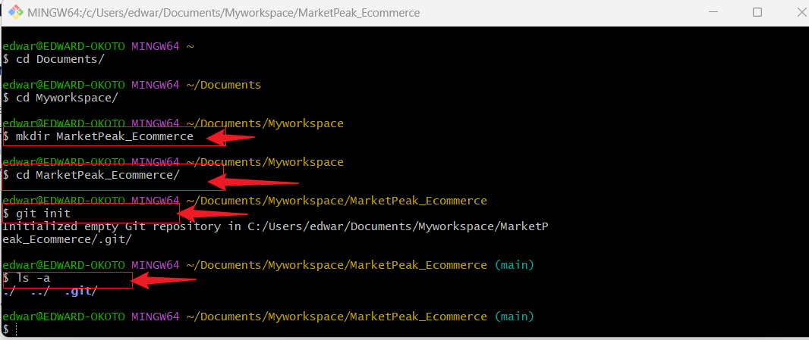
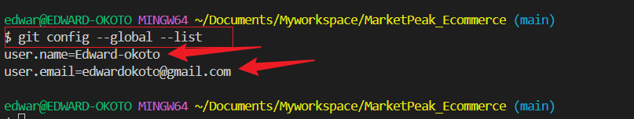

# **E-Commerce Platform Deployment With Git, Linux and AWS**

### Implement Version Control with GIT
* Create a repository named MarketPeak_Ecommerce `mkdir MareketPeak_Ecommerce`
* Inside this directory,Initialize a GIT repository with `git init` command

* Download and add the website files to the Git repository

* Set Git global configuration with your username and password. You can set it with this command 

    `git config --global user.name "Your Name"`

    `git config --global user.name "email"`

    Confirm the username and email is set with command below

     `git config --global --list`
    

* Commit changes with clear and descriptive message

