# **E-Commerce Platform Deployment With Git, Linux and AWS**

## **Implement Version Control with GIT**
* Create a repository named MarketPeak_Ecommerce `mkdir MareketPeak_Ecommerce`
* Inside this directory,Initialize a GIT repository with `git init` command

* Download and add the website files to the Git repository

* Set Git global configuration with your username and password. You can set it with this command 

    `git config --global user.name "Your Name"`

    `git config --global user.name "email"`

    Confirm the username and email is set with command below

     `git config --global --list`
    

* Stage and Commit changes with clear and descriptive message
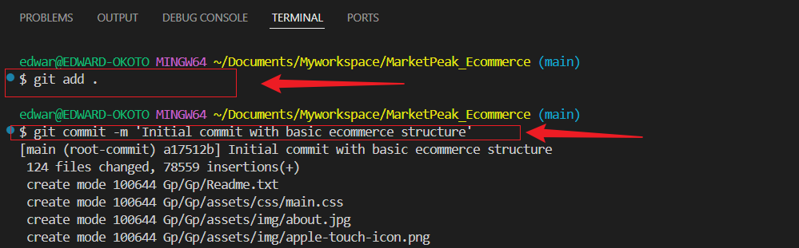
* Push the codes to GitHub repository

      Firstly,create a remote repository named `MarketPeak_Ecommerce`.Leave the repository empty without initializing with README, gitignore or Licence.
      
     
  
  Next,Link the local repository to GitHub : git remote add origin

  `git remote add origin https://github.com/Edward-okoto/MarketPeak_Ecommerce.git`
    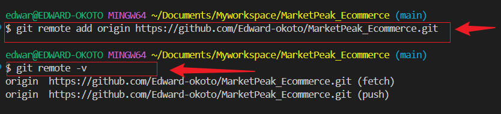

    To push the codes to GitHub, run command 

    `git push -u origin main`
    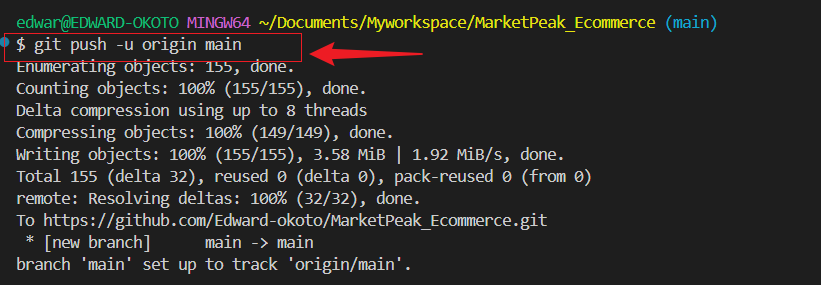
    The push command enable us to push the our commit from the local main branch to the remote GitHub repository,enabling us to store our projects in the cloud and share with others.

    local repo files/directory has been pushed to GitHub
    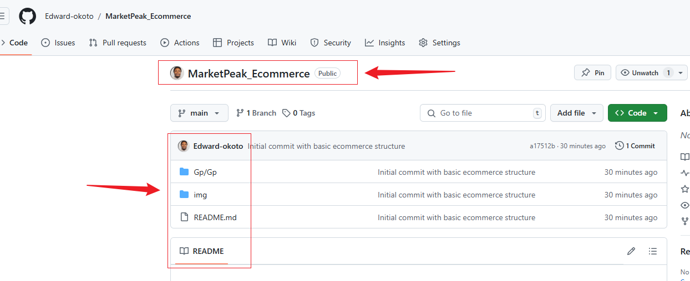

   ## **AWS Deployment**
    ### Setting up an AWS EC2 instance

  * Log in to the AWS management console 
  * Launch an EC2 instance using an Amazon Linux AMI
  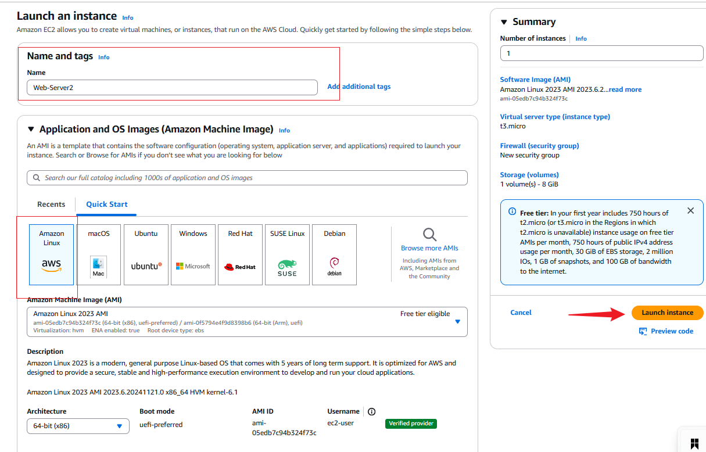
  * Connect to the instance using SSH

    Click instance ID
  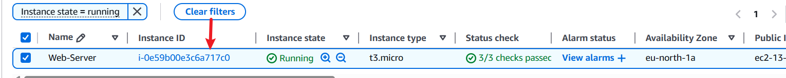
  Copy the public Ip address
  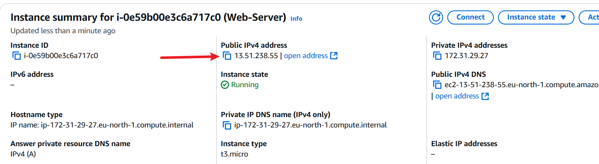
  Go to mobaxterm terminal, click new session,input the Ip address,default username is `ec2-user` and add the key generated(downloaded) on your local machine when instance was created.
  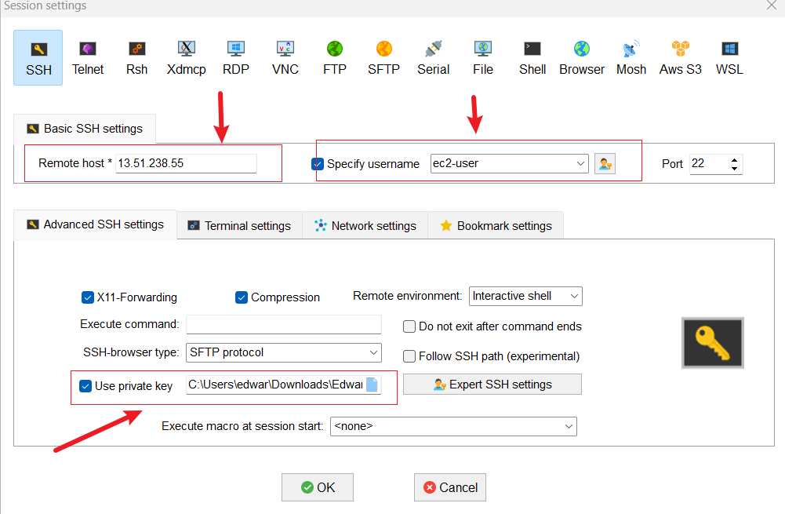

  #### Clone the `MarketPeak_Ecommerce` Repository on the Linux Server.
  * On GitHub copy the SSH code
  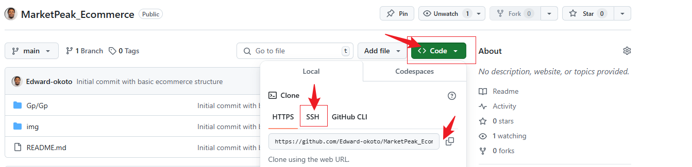
  * Generate SSH keypair on EC2 instance using `ssh-keygen`
  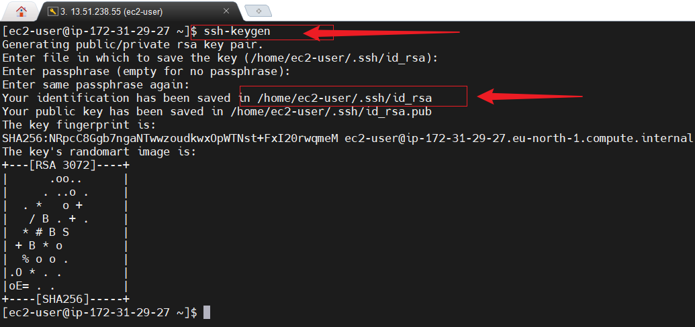
  * Display and copy the key

     `cat /home/ec2-user/.ssh/id_rsa`
  * Add the public SSH key to GitHUB account
    Go to GitHub, click settings, click SSH and GPG keys
    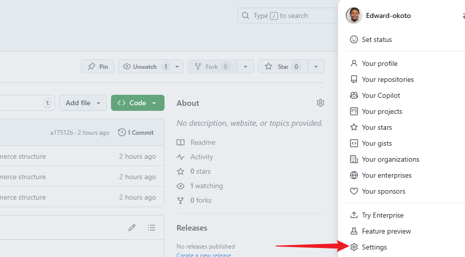
  * click `New SSH key` and add the public key
    
  * Use the SSH code to clone the repository
  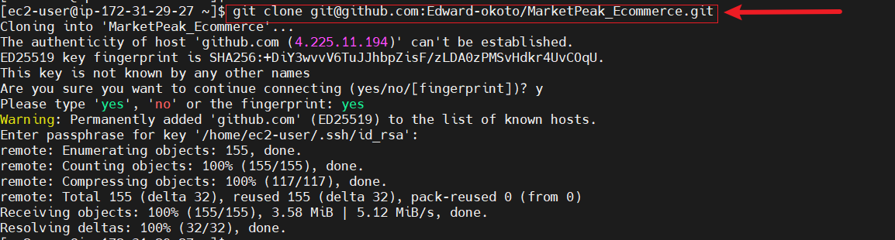
  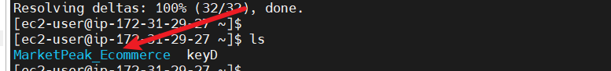

  ## Install WebServer on EC2

    * Install Apache Http server
  
      `sudo yum update -y`

      `sudo yum install httpd -y`

      `sudo systemctl start httpd`

      `sudo systemctl enable httpd`

      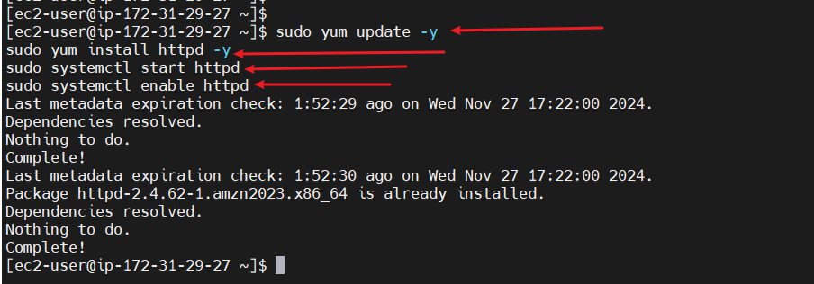
  ### Configure httpd for Website
    * **Prepare the web directory**: Clear the default httpd web directory and copy the MarkerPeak_Ecommerce fies into it.

           sudo rm -rf /var/www/html/*

          sudo cp -r ~/MarketPeak_Ecommerce/* /var/www/html/
    * **Reload httpd**:Apply the changes by reloading httpd.

          sudo systemctl reload httpd

 Access Website from Browser

    Use the public ip and the path to the http server files to browse to the website.  `http://16.171.63.100/TrinityTekeme/okoto`
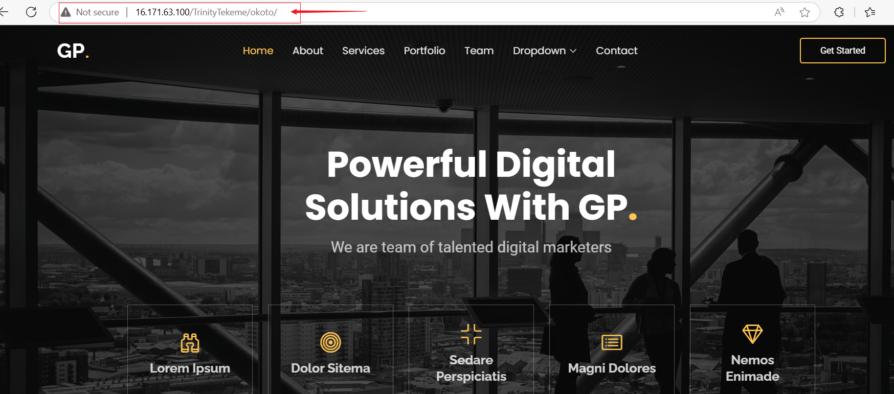

### **Continuous Integration and Deployment Workflow**
* Develop new features and fixes

   Procedure: 
   
   * **Create a `Development Branch`** and begin work from there to isolate new features and bug fixes from the stable version of the website.

     `git branch Development`
   

   * **Implement changes**: 
    
      Starter-page.html was updated to reflect new Template name and version
   * **Stage Changes**
     
     `git add .`
      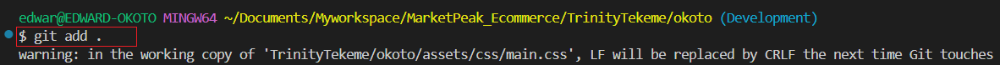
   * **Commit the changes**   
     `git commit -m 'Template name and version updated`
      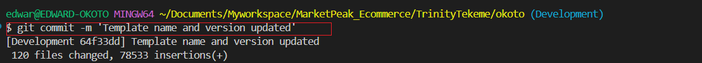
   * **Push changes to GitHub**

     `git push origin Development`
      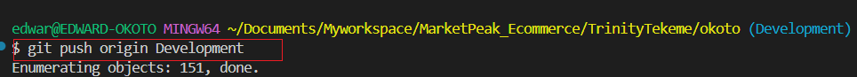
   * **Create a PR and Merge**
   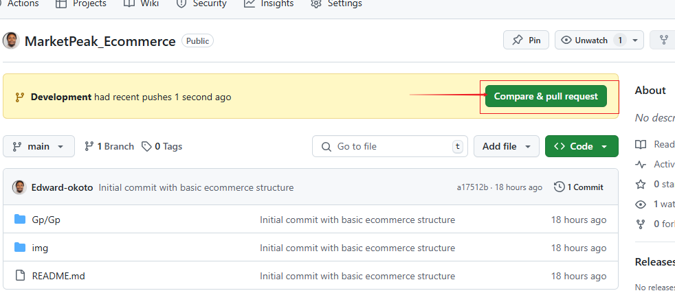
   * **Deploy updates to the production Server and Test changes**

     * Pull the latest changes from GitHUB to the webserver

     `git pull origin main`
     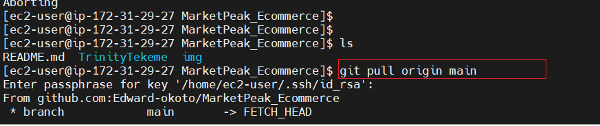

     * Test the changes

     

# **Key Challange**

* **Problems Encountered**: Website didnt work even after configuration was double-checked.

* **Solution** : Allow HTTP traffic on port 80 in the inbound Security Group for the EC2 instance.

   

